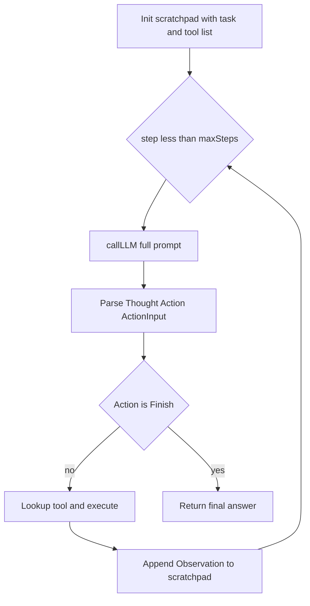

# 最简 ReAct 闭环 Agent（TypeScript）

## 目标与约束

- **ReAct 闭环**：每轮根据当前 scratchpad 调用「模型」得到 `Thought` + `Action`（或终止），执行工具得到 `Observation`，拼回上下文再进入下一轮，直到 `Finish` 或达到步数上限。
- **LLM 先空着**：单独文件导出 `callLLM(prompt: string): Promise<string>`，内部为 `TODO` 占位（可 `throw` 或返回固定演示串，二选一在实现时定一种即可）。
- **范围**：不引入框架（无 LangChain），仅类型 + 循环 + 简单解析；依赖尽量少（`typescript` + `tsx` 或 `ts-node` 用于本地跑示例）。

## ReAct 文本协议（与论文常见格式对齐）

采用单轮模型输出中可解析的块（便于手写 parser，无需 JSON mode）：

```text
Thought: ...
Action: tool_name | Finish
Action Input: ...   # Finish 时为最终答案
```

解析失败或缺少字段时：将错误信息作为一条 `Observation` 写回 scratchpad，或直接进入下一轮（实现时选一种简单策略）。

## 建议文件布局

| 文件 | 职责 |
|------|------|
| [`package.json`](package.json) | `typescript`、`tsx`（或等价）dev 依赖；`"type": "module"` 可选 |
| [`tsconfig.json`](tsconfig.json) | `strict`、`moduleResolution: bundler` 或 `node16` |
| [`src/types.ts`](src/types.ts) | `Tool`（`name`, `description`, `execute(input: string): Promise<string>`）、`AgentStep` / 轨迹类型（可选） |
| [`src/prompt.ts`](src/prompt.ts) | 根据 `userTask`、`tools`、当前 `scratchpad` 拼系统/用户提示（常量模板字符串） |
| [`src/parse.ts`](src/parse.ts) | 从模型原文本中提取 `Thought`、`Action`、`Action Input`（正则或按行扫描） |
| [`src/llm.ts`](src/llm.ts) | **占位**：`export async function callLLM(prompt: string): Promise<string>` |
| [`src/agent.ts`](src/agent.ts) | 核心 `runReActAgent(options)`：`tools`, `task`, `maxSteps`, `callLLM` 注入 |
| [`src/index.ts`](src/index.ts) | 极小示例：注册 1～2 个假工具（如 echo / add），演示循环（若 `callLLM` 为 throw，则示例仅展示类型与调用链，或注释说明需先实现 `callLLM`） |

## 核心循环逻辑（[`src/agent.ts`](src/agent.ts)）



- **注入 `callLLM`**：便于单测或将来替换为 OpenAI/内部 API，不硬编码在 agent 内。
- **终止条件**：`Action === "Finish"` 时返回 `Action Input`；或步数用尽返回明确状态（如 `{ ok: false, reason: 'max_steps' }`）。

## 验证方式

- `npx tsc --noEmit` 确保类型通过。
- 可选：对 `parse.ts` 写 1～2 个单元测试（若希望零测试依赖可省略，仅手动示例）。

## 不做的内容（保持「最简」）

- 无流式输出、无多模态、无记忆持久化、无复杂重试/退避。
- 不编辑用户未要求的文档（如 README），除非你在确认阶段明确要求。
